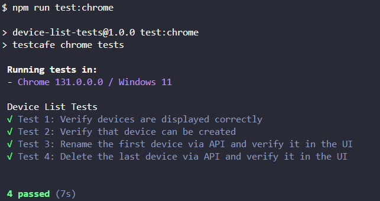

# Automated Testing with TestCafe

## Requirements / Prerequisites

To run the TestCafe tests for this project, ensure the following:

1. **Backend API**:
   - The backend project must be running locally on `http://localhost:3000/devices`.
2. **Frontend Application**:
   - The frontend project must be running locally on `http://localhost:3001/`.

Both the backend and frontend must be started before executing the tests to ensure the tests interact with the application correctly.

## Installation

To set up the testing project, follow these steps:

1. Clone the testing project repository:
   ```bash
   git clone https://github.com/drjunior90/ninjaOneQAShowcase.git
   ```
2. Navigate to the project directory:
   ```bash
   cd ninjaOneQAShowcase
   ```
3. Install the dependencies:
   ```bash
   npm install
   ```

## Available Scripts

The following scripts are available to run tests:

1. **Run Tests in a Specific Browser**:
   Specify a browser (e.g., Chrome, Firefox) for the tests:
   ```bash
   npm run test:chrome
   ```

2. **Run Tests in Headless Mode**:
   Run tests in headless mode for CI/CD environments:
   ```bash
   npm run test:chrome:headless
   ```

## Test Results and Reports

After running the tests, TestCafe will display a detailed summary in the console, showing:

- The number of tests executed.
- The pass/fail status of each test.
- The duration of the test run.

Here is an example of the output:


